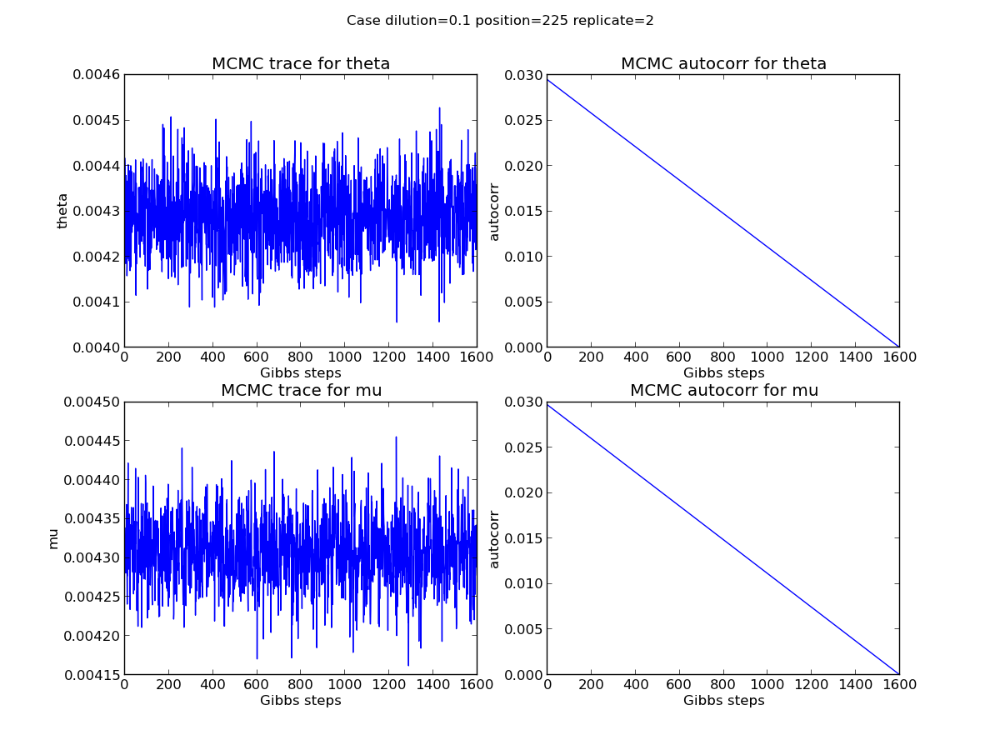
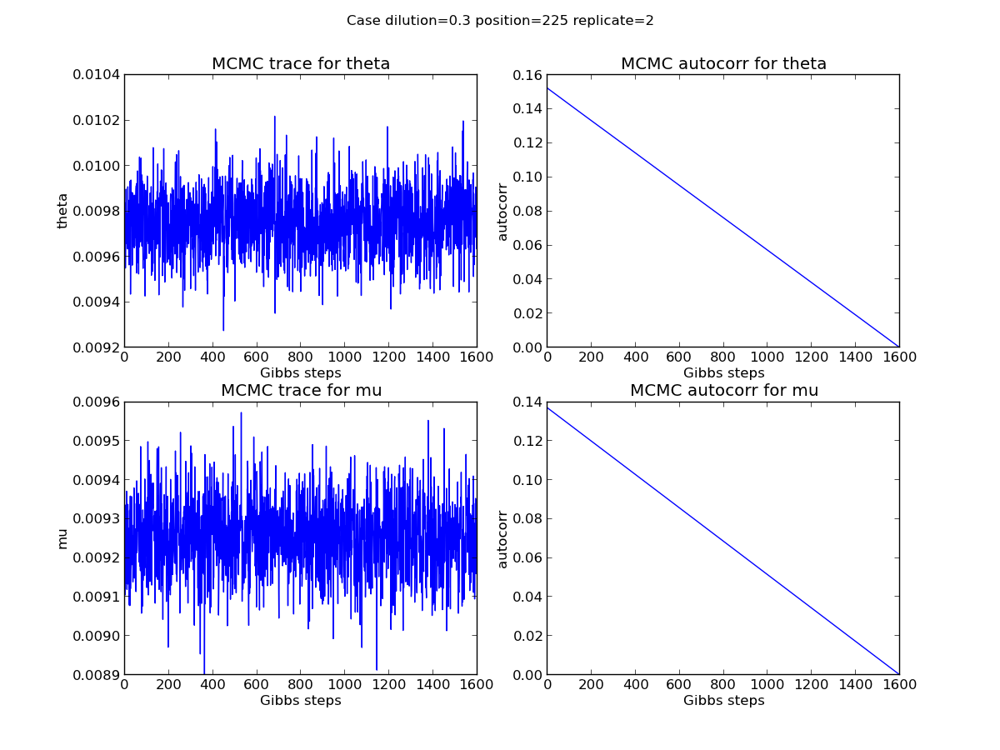
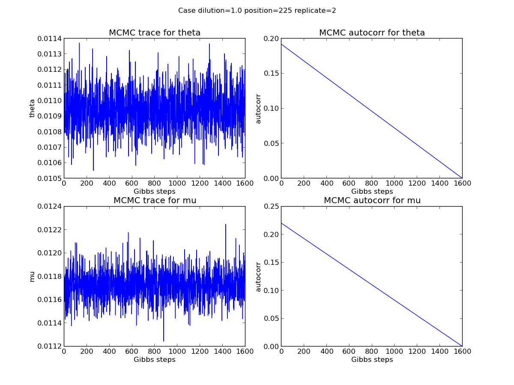
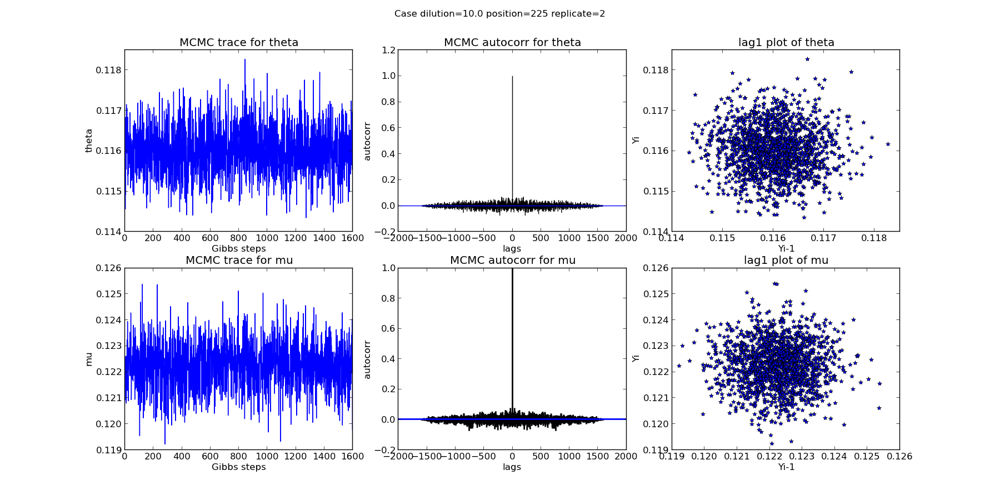
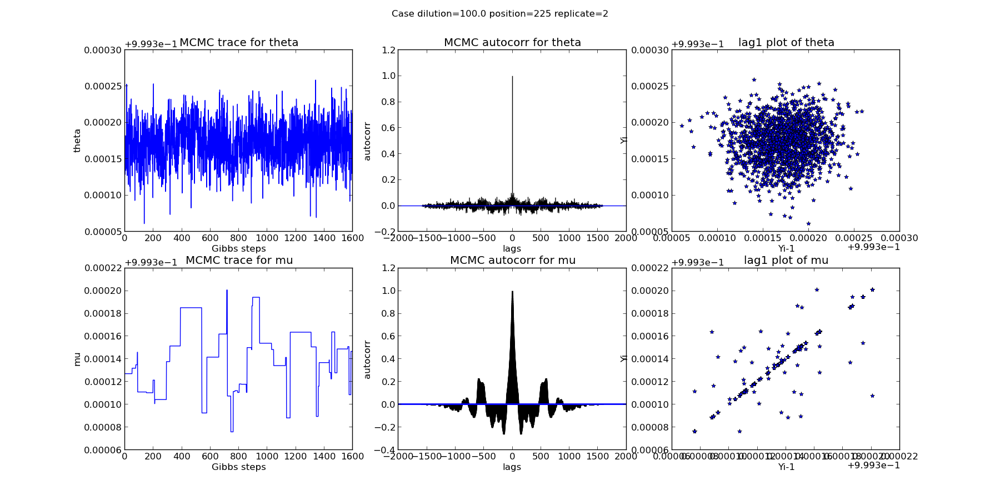
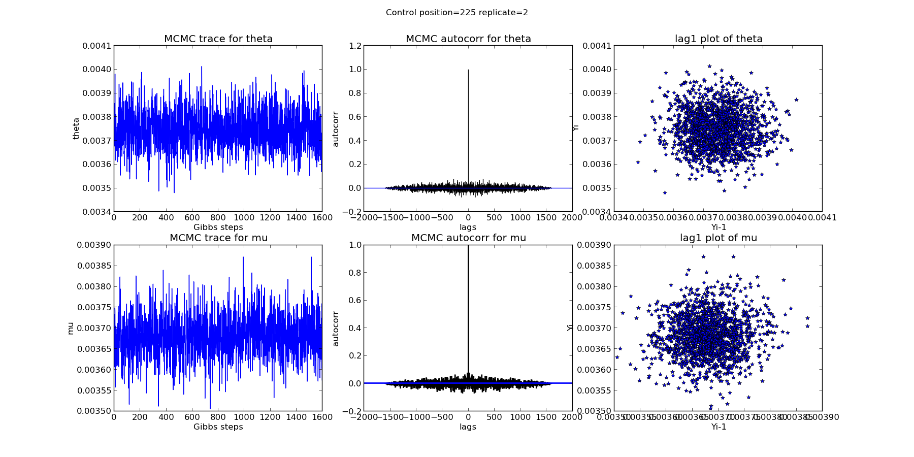

2013-08-02 MCMC traces and auto correlation analysis
==============================

Purpose
------------
Plot MCMC sampling traces and do auto correlation analysis to find out whether there is obvious pattern between MCMC sampling steps.

Conclusions
-----------------
1. There is no obvious pattern among the MCMC samples.
2. The posterior of mu at position 225 when dilution is 100.0 was not well sampled. 

Background
-----------------
A good reference on autocorrelation can be found at [autocorrelation](http://www.itl.nist.gov/div898/handbook/eda/section3/eda35c.htm)

Materials and Equipment
------------------------------

Experimental Protocol
---------------------------

Results
-----------
From the autocorrelation plot and lag1 plot it can be seen that:
1. There is no obvious pattern among the MCMC samples.
2. The posterior of mu at position 225 when dilution is 100.0 was not well sampled. 

Archived Samples
-------------------------

Archived Computer Data
------------------------------

Prepared by: _________Yuting He ________     Date: _____________________

Witnessed by: ________________________
