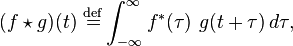
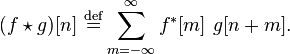
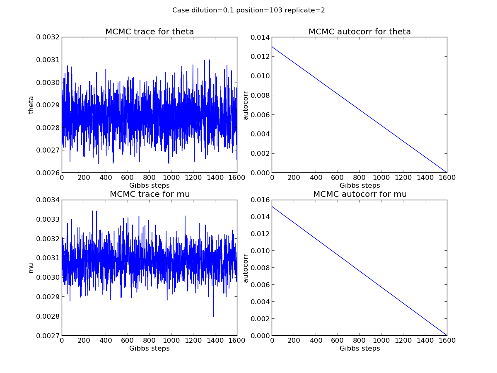
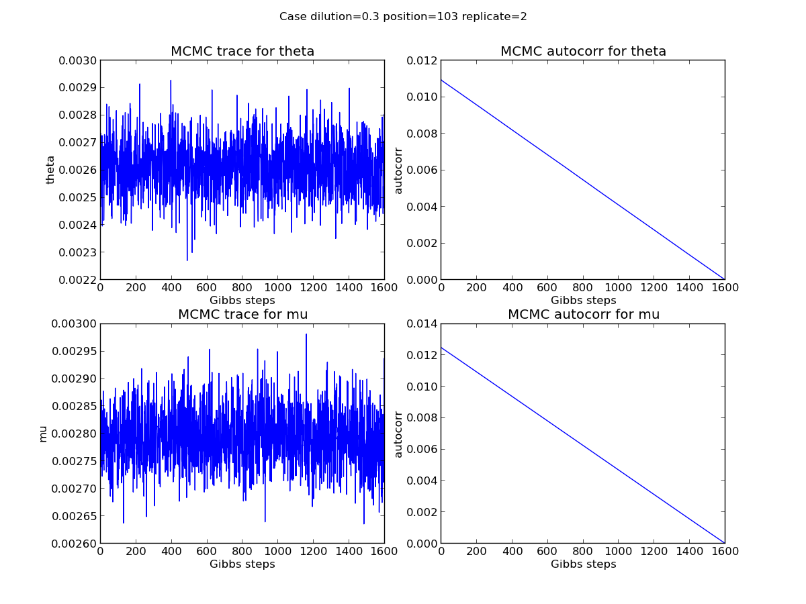
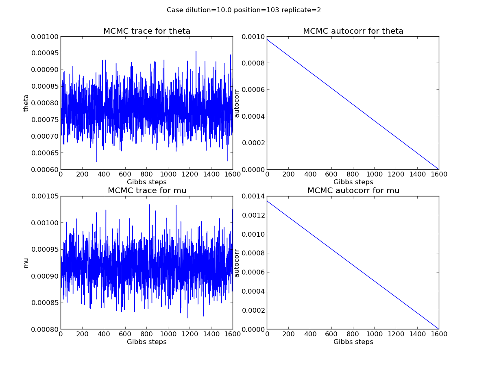
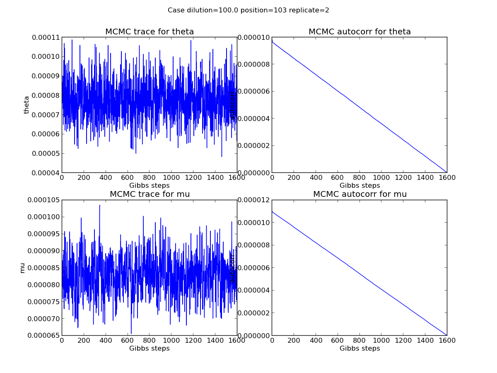

2013-08-02 MCMC traces and auto correlation analysis
==============================

Purpose
------------
Plot MCMC sampling traces and do auto correlation analysis to find out whether there is obvious pattern between MCMC sampling steps.

Conclusions
-----------------
1. There is no obvious pattern among the MCMC sampling
2. The variance of the MCMC samples is very small comparing to the sample mean, which results in the fact that the auto correlation of posterior samples of theta or mu is basically a linear line. 
3. The posterior of mu at position 225 when dilution is 100.0 was not well sampled. 

Background
-----------------
Cross-correlation is a measure of similarity of two waveforms as a function of a time-lag applied to one of them. 

For **continuous functions** f and g, the cross-correlation is defined as:

where f* denotes the complex conjugate of f.

Similarly, for **discrete functions**, the cross-correlation is defined as:

**Auto correlation** is the cross-correlation of a signal with itself.

Materials and Equipment
------------------------------

Experimental Protocol
---------------------------

Results
-----------

1. There is no obvious pattern among the MCMC sampling
2. The variance of the MCMC samples is very small comparing to the sample mean, which results in the fact that the auto correlation of posterior samples of theta or mu is basically a linear line. 
3. The posterior of mu at position 225 when dilution is 100.0 was not well sampled. 

Archived Samples
-------------------------

Archived Computer Data
------------------------------

Prepared by: _________Yuting He ________     Date: _____________________

Witnessed by: ________________________
