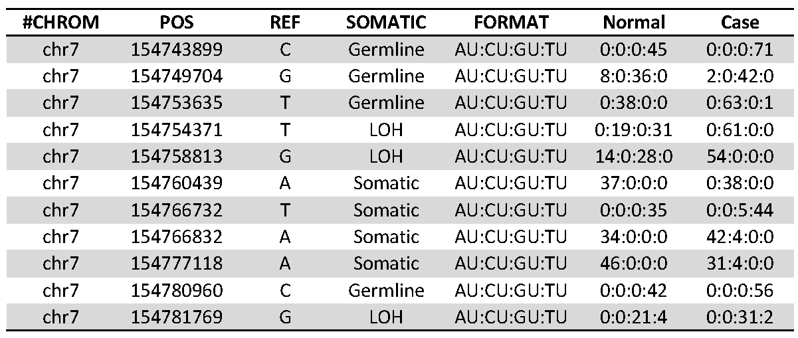
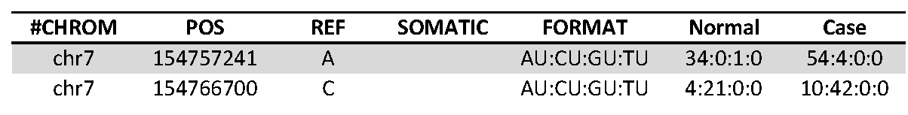
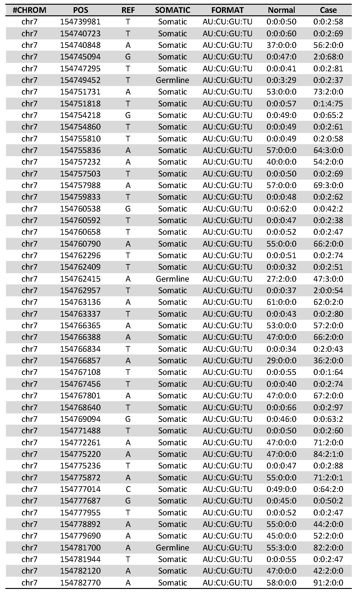

2014-03-11 SNP calling using varscan2 somatic mode in clinical dataset HCC1187
==============================

Purpose
------------
To compare varscan2(somatic mode) with rvd2 in Clinical dataset HCC1187

Conclusions
-----------------
Compared with RVD2 (result from folder `2014-03-11_combined_somatic_test_HCC1187_dataset`), Varscan2 somatic has high sensitivity. Telling from the depth chart by eye, Varscan2 somatic detected 11 mutated positions, missed 2 mutated positions and called 50 non-mutated positions. 3 of the 11 True Positives are LOH event.

Background
----------------

Materials and Equipment
------------------------------
`rvd2/bin/varscan.v2.3.4.jar somatic`

Experimental Protocol
---------------------------
Run `SNP_varscan2_HCC1187.sh`to get the call table `HCC1187.snp`. Run `snp2vcf.py` to convert `HCC1187.snp` to standard files in RVD2 for comparison.

**Output of varscan2 somatic: Variant Calling and Comparison**

At every position where both normal and tumor have sufficient coverage, a comparison is made. First, normal and tumor are called independently using the germline consensus calling functionality. Then, their genotypes are compared by the following algorithm: 

    If tumor matches normal: 
        If tumor and normal match the reference 
            ==> Call Reference 
        Else tumor and normal do not match the reference 
            ==> Call Germline 

    Else tumor does not match normal: 
    Calculate significance of allele frequency difference by Fisher's Exact Test 
        If difference is significant (p-value < threshold):
            If normal matches reference
                ==> Call Somatic
            Else If normal is heterozygous
                ==> Call LOH
            Else normal and tumor are variant, but different
                ==> Call IndelFilter or Unknown
        Else difference is not significant:
        Combined tumor and normal read counts for each allele. Recalculate p-value.
            ==> Call Germline 

Results
-----------
**Table 1. Positions called by Varscan2 somatic which are likely to be true positives from the depth matrix.**

**Table 2. Positions missed by Varscan2 somatic which are likely to be false negatives from the depth matrix.**

**Table 2. Positions called by Varscan2 somatic which are likely to be false positives from the depth matrix.**

Archived Samples
-------------------------

Archived Computer Data
------------------------------

Prepared by: ______Yuting He___________     Date: ________03/11/2014_____________

Witnessed by: ________________________
