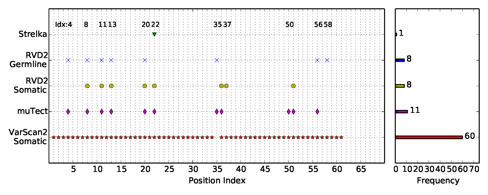
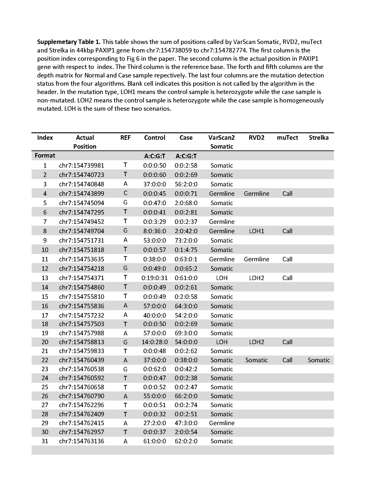
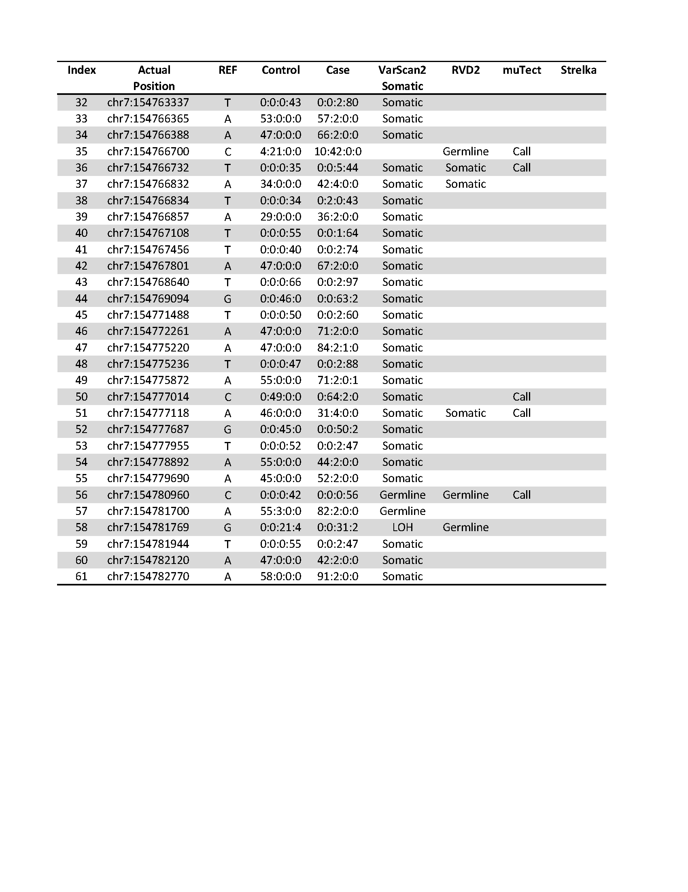

2014-03-12 Plot mutation positions detected by multiple algorithms in clinical dataset HCC1187
==============================

Purpose
------------
To visualize and compare the positions called by multiple algorithms in clinical dataset HCC1187

Conclusions
-----------------
See result section.

Background
----------------

Materials and Equipment
------------------------------

Experimental Protocol
---------------------------
Run `mutation_dotplot.py`

**Output of varscan2 somatic: Variant Calling and Comparison**

Results
-----------

Archived Samples
-------------------------

Archived Computer Data
------------------------------

Prepared by: ______Yuting He___________     Date: ________03/12/2014_____________

Witnessed by: ________________________
