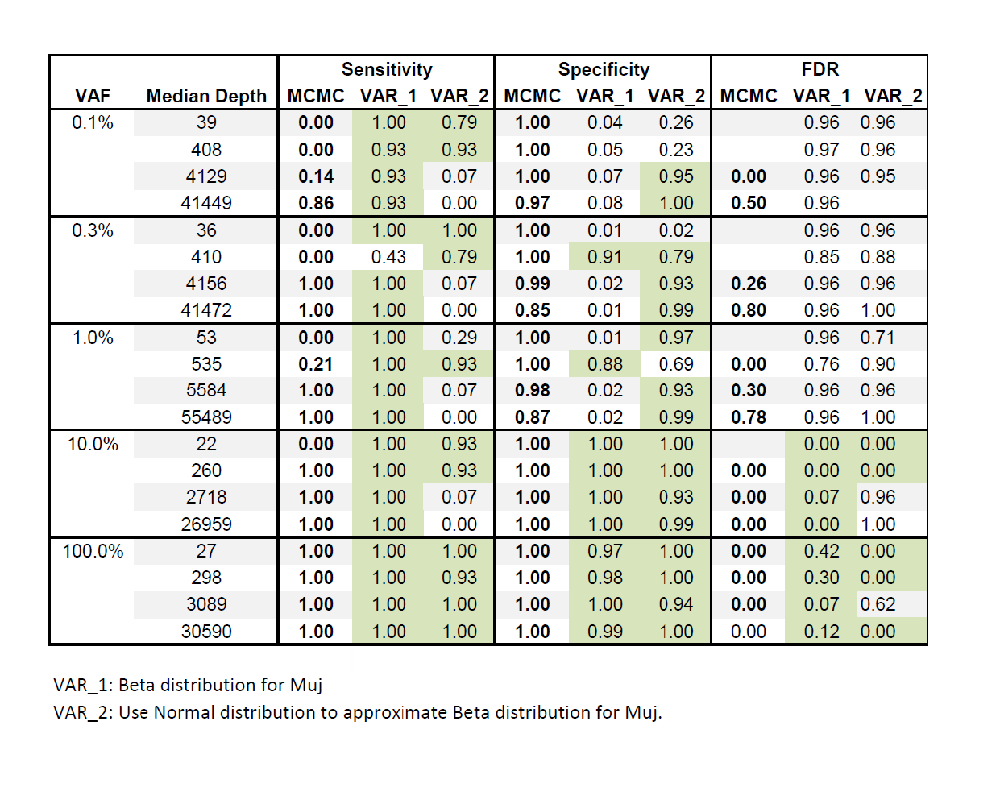

22015-09-21_Use Normal approximate Beta in rvd2 var
==============================

Purpose
------------
Use Normal distribution to approximate Beta distribution.  
Test if it works better in sensitivity and specificity on the synthetic data set.

Conclusions
-----------------
 
   
Background
-----------------
Beta distribution is the proposal variational distribution for both Muj and \theta.  
Need to calculate "Expectation of Beta function coefficient (incorporate Gamma functions)"

[http://www.vosesoftware.com/ModelRiskHelp/index.htm#Distributions/Approximating_one_distribution_with_another/Normal_approximation_to_the_Beta_distribution.htm](http://www.vosesoftware.com/ModelRiskHelp/index.htm#Distributions/Approximating_one_distribution_with_another/Normal_approximation_to_the_Beta_distribution.htm)

Materials and Equipment
------------------------------

Experimental Protocol
---------------------------
1.  `python rvd2_var.py`
2.  `python runall.py`
3.  `python test_all.py`
4.  `python character.py`

##### 

Results
----------- 
It takes around 30mins to approximate variational distribution for the latent variables (muj, thetaij) and parameters (mu0, M0, and M).     
  

	M-iteration	E-iteration	ELBO	Increase Percentage	delta-deltaprev	gam-gamprev	t-gam	t-delta	t-mu0	t-M0	t-M
	0	0	-169712310.26	0.000%							
	0	1	-54029814.93	68.164%	54079.39	7008.66	123.53	1.42			
	0	2	-39971807.93	26.019%	15552.79	4776.41	84.41	0.95			
	0	3	-39944810.07	0.068%	1842.33	1237.16	66.14	0.78			
	1	0	-22692101.20	86.629%					0.29	5.70	18.05
	1	1	-21298.33	99.906%	30994.44	7823.08	167.25	1.33			
	1	2	-20792.58	2.375%	1081.78	2246.84	99.29	0.92			
	1	3	-20791.99	0.003%	0.02	1018.10	32.31	0.98			
	2	0	-20611.33	99.909%					1.42	0.70	8.26
	2	1	-20611.15	0.001%	0.02	583.63	97.01	1.19			
	3	0	-20611.11	0.001%					1.32	0.66	7.81
	Total elapsed time is 1672.086 seconds.

####- Statistics.xls:
	
	VAF	Median Depth	RVD2_Var(T=0,R=6)
	0.1%	39	0.79/0.26
		408	0.93/0.23
		4129	0.07/0.95
		41449	0.00/1.00
	0.3%	36	1.00/0.02
		410	0.79/0.79
		4156	0.07/0.93
		41472	0.00/0.99
	1.0%	53	0.29/0.97
		535	0.93/0.69
		5584	0.07/0.93
		55489	0.00/0.99
	10.0%	22	0.93/1.00
		260	0.93/1.00
		2718	0.07/0.93
		26959	0.00/0.99
	100.0%	27	1.00/1.00
		298	0.93/1.00
		3089	1.00/0.94
		30590	1.00/1.00

####- Compare VAR\_1 (Beta for Muj), VAR\_2 (Normal for Beta approximation), and MCMC:

VAR\_1 works well in Sensitivity, but doesn't work well in Specificity of low VAF events.  
VAR\_2 works well in Specificity, but doesn't work well in Sensitivity of high read depth events.  
VAR\_1 and VAR\_2 don't work well in FDR of low VAF events. 

Archived Samples
-------------------------

Archived Computer Data
------------------------------

Prepared by: _______Fan Zhang_______     Date: _____________________

Witnessed by: ________________________
